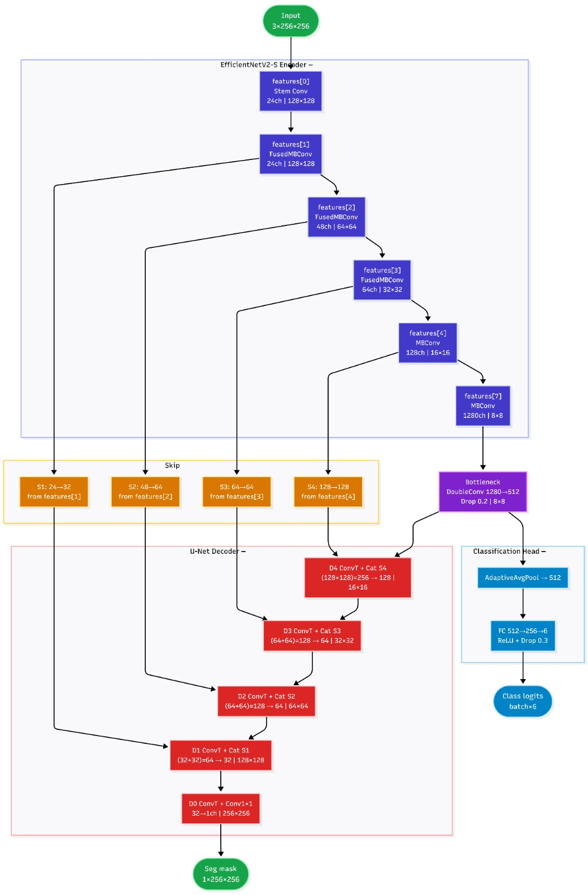
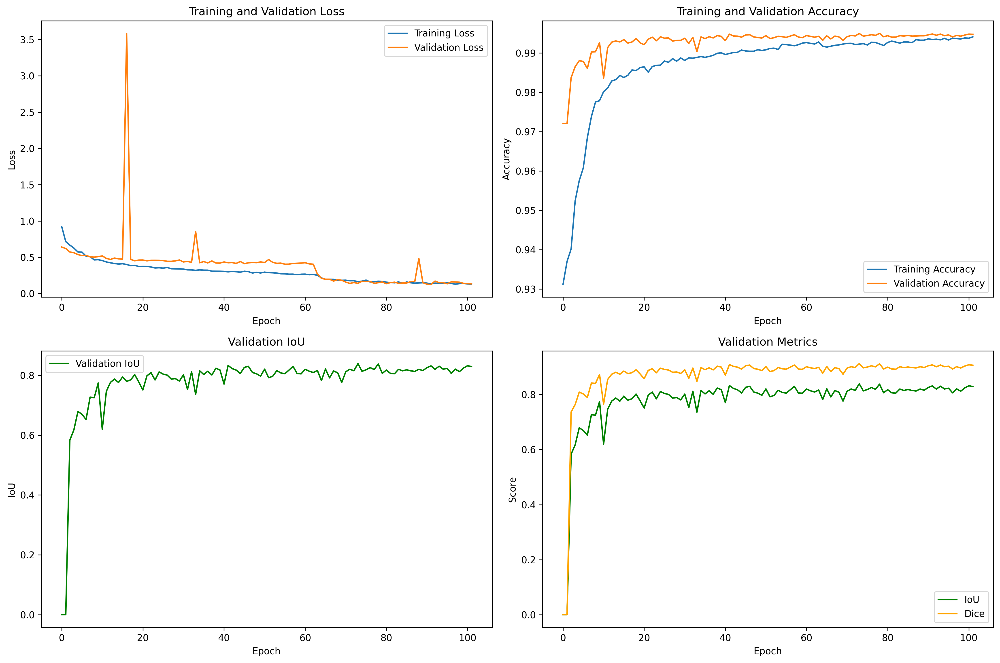
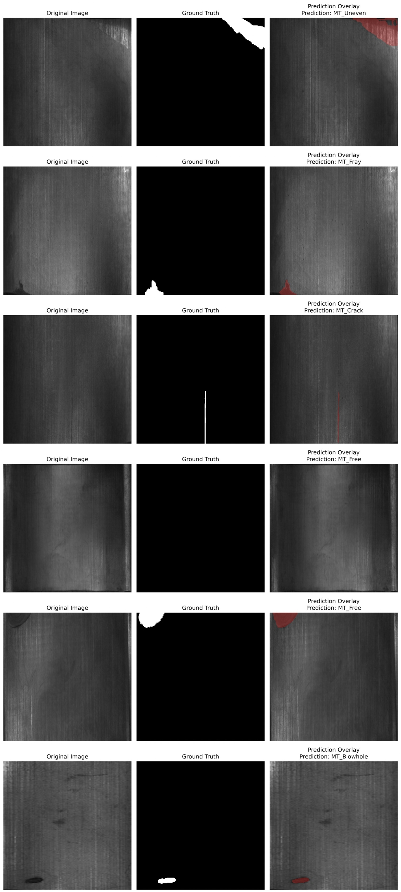
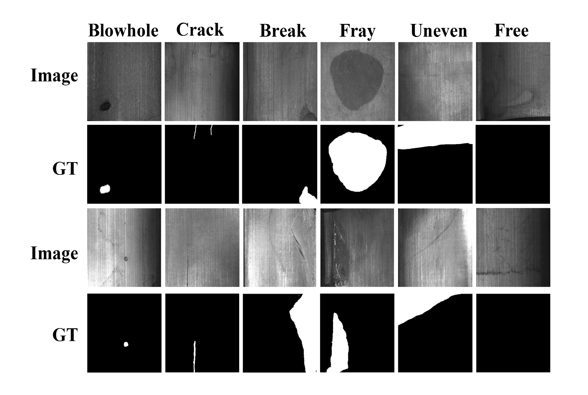

# Segmentation of Damaged Magnetic Tiles

A multi-task deep learning system that segments and classifies surface defects on magnetic tiles from a single forward pass. Given a tile image, the model produces a pixel-level defect mask and a defect-type label at the same time, instead of relying on two separate pipelines.

Magnetic tiles are used heavily in motors, sensors, and other electromagnetic components, and surface defects like blowholes, cracks, and breaks directly affect performance. Most factories still rely on manual visual inspection, which is slow and inconsistent at scale. This project was built to automate that process end to end, from detection to a usable web interface.

The approach and results are written up in more detail in the accompanying paper, *EfficientNetV2-S U-Net Based Multi-Task Detection of Magnetic Tile Defects*.

## What it does

- Takes a 256x256 magnetic tile image as input
- Outputs a binary segmentation mask locating the defect
- Classifies the defect into one of six categories: Blowhole, Break, Crack, Fray, Uneven, or Free (no defect)
- Overlays the predicted mask on the original image and reports the defect ratio
- Optionally generates a severity estimate and recommendation using a local LLaVA model through Ollama

## Architecture

The core model pairs a frozen, pretrained EfficientNetV2-S encoder with a U-Net style decoder, and adds a classification head that branches off the bottleneck. The encoder handles feature extraction, the decoder reconstructs a full-resolution segmentation map using skip connections at four scales, and the classification head runs in parallel off the same shared features.

Segmentation loss is a weighted combination of Binary Cross-Entropy and Dice loss, and classification uses standard CrossEntropy loss, all trained jointly with AdamW and a ReduceLROnPlateau schedule.

## Results

Before settling on the final design, we compared segmentation architectures, encoder backbones, and attention modules.

**Segmentation architecture (U-Net vs U-Net++)**

| Model     | IoU    | Dice   | Precision | Recall | F1     |
|-----------|--------|--------|-----------|--------|--------|
| U-Net     | 0.7839 | 0.8789 | 0.8947    | 0.8636 | 0.8789 |
| U-Net++   | 0.7816 | 0.8774 | 0.5777    | 0.9402 | 0.8774 |

U-Net matched U-Net++ on performance while training in roughly 40 minutes against nearly 3 hours for U-Net++, so it was kept as the baseline.

**Encoder backbone comparison**

| Backbone         | IoU    | mIoU   | Dice   | F1     | Accuracy |
|------------------|--------|--------|--------|--------|----------|
| EfficientNetV2-S  | 0.8451 | 0.9202 | 0.9160 | 0.9160 | 0.9956   |
| ResNet50          | 0.8011 | 0.8977 | 0.8896 | 0.8896 | 0.9944   |
| ConvNeXt          | 0.1058 | 0.5382 | 0.1914 | 0.1914 | 0.9708   |

EfficientNetV2-S came out ahead on every metric and was chosen as the final backbone. ConvNeXt underperformed noticeably, likely because it needs more training data than this dataset provides.

**Attention modules**

CBAM, SE, and Triplet Attention were each tested on top of the EfficientNetV2-S U-Net. None improved on the baseline, and Triplet Attention hurt performance significantly, so the final model was kept without any added attention mechanism.

**Final model**

- IoU: 84.51%
- mIoU: 92.02%
- Dice: 91.60%
- F1-score: 91.60%
- Accuracy: 99.56%

**Training curves**

Loss decreases steadily for both training and validation, with a few brief spikes from harder batches that the model recovers from immediately. IoU and Dice climb quickly in the early epochs and then level off.

**Qualitative results**

Each row shows the original tile image, the ground truth mask, and the predicted overlay with the defect region highlighted in red, along with the predicted class. The model localizes blowholes, cracks, breaks, and fraying with tight boundaries, and correctly leaves defect-free tiles unmarked.

## Dataset

The project uses the magnetic tile defect dataset introduced by Huang et al., containing 1,344 images across six categories: Blowhole, Break, Crack, Fray, Uneven, and Free. Each image comes with a pixel-level ground truth mask. Class-specific augmentation was applied before splitting the data into training, validation, and test sets in a 60:20:20 ratio.

